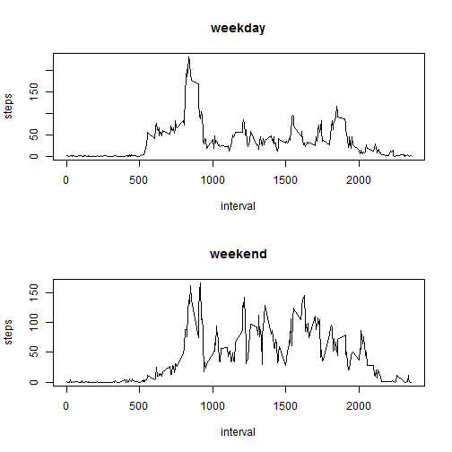

# Reproducible Research: Peer Assessment 1

This document makes use of data from a personal activity monitoring device. This device collects data at 5 minute intervals through out the day. The data consists of two months of data from an anonymous individual collected during the months of October and November, 2012 and include the number of steps taken in 5 minute intervals each day. [1] 

## Loading and preprocessing the data

1. The dataset is stored in a comma-separated-value (CSV) file and there are a total of 17,568 observations [1].  The variables included in this dataset are:

* steps: Number of steps taking in a 5-minute interval (missing values are coded as NA)
* date: The date on which the measurement was taken in YYYY-MM-DD format
* interval: Identifier for the 5-minute interval in which measurement was taken


```r
    unzip("repdata_data_activity.zip")
    M <- read.csv("activity.csv")   ## data with NA
```

2. Process into a format suitable for analysis


```r
    M$date <- as.Date(M$date)
```

## What is mean total number of steps taken per day?

For this part we ignore the missing values in the dataset.

1. Histogram of the total number of steps taken each day


```r
    Ms <- aggregate(steps~date, M, sum)$step
    hist(Ms, breaks=20, xlab="steps by date")
```

 

2. Mean and median total number of steps taken per day


```r
    mean(Ms)
```

```
## [1] 10766
```

```r
    median(Ms)
```

```
## [1] 10765
```

## What is the average daily activity pattern?

1. Time series plot of the 5-minute interval vs average number of steps taken, averaged across all days


```r
    Msi <- aggregate(steps~interval, M, mean)
    plot(Msi, type="l")
```

 

2. Which 5-minute interval, on average across all the days in the dataset, contains the maximum number of steps?


```r
    Msi$interval[which.max(Msi$steps)]
```

```
## [1] 835
```

## Imputing missing values

1. Number of missing values in the dataset (i.e. the total number of rows with NAs)


```r
    sum(is.na(M))
```

```
## [1] 2304
```

2. A non sophisticated strategy for filling in all of the missing values in the dataset (MA) is use the means for the 5-minute intervals as fillers for missing values.

3. New dataset that is equal to the original dataset but with the missing data filled in.


```r
    M <- merge(M, Msi, by='interval', suffixes=c("", ".y")) 
    nas <- is.na(M$steps)
    M$steps[nas] <- M$steps.y[nas]
```

Note that suffixes leave 'steps' instead 'steps.x'

4. Histogram of the total number of steps taken each day


```r
    Ms <- aggregate(steps~date, M, sum)$step
    hist(Ms, breaks=20, xlab="steps by date")
```

 

Mean and median total number of steps taken per day. 


```r
    mean(Ms)
```

```
## [1] 10766
```

```r
    median(Ms)
```

```
## [1] 10766
```

*Do these values differ from the estimates from the first part of the assignment?*

They differ in a few decimals from the original values.

*What is the impact of imputing missing data on the estimates of the total daily number of steps?*

The impact of the missing data seems very low.

## Are there differences in activity patterns between weekdays and weekends?

1. A new factor variable in the dataset with two levels – “weekday” and “weekend” indicating whether a given date is a weekday or weekend day.


```r
    ss <- weekdays(as.Date(c("14-08-16","14-08-17")))
    weekn <- function(d) {
        wd <- weekdays(d) %in% ss
        if (wd) {"weekend"} else {"weekday"}
    }
    M$weekend <- as.factor(sapply(M$date, weekn))
```

2. A panel plot containing a time series plot of the 5-minute interval and the average number of steps taken, averaged across all weekday days or weekend days.


```r
    par(mfrow = c(2, 1))
    for (w in c("weekday", "weekend")) {
        Msi <- aggregate(steps~interval, M, mean, subset=(M$weekend==w))
        plot(Msi, type="l", main=w)
    }
```

 

## References 
[1] Coursera, Reproducible Research, by Roger D. Peng, PhD, Jeff Leek, PhD, Brian Caffo, PhD; https://github.com/rdpeng/RepData_PeerAssessment1

